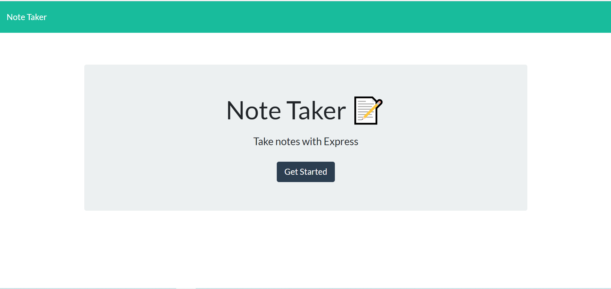
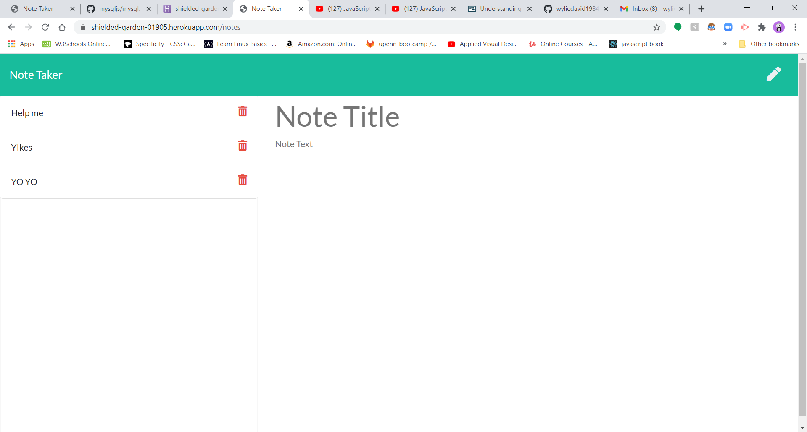
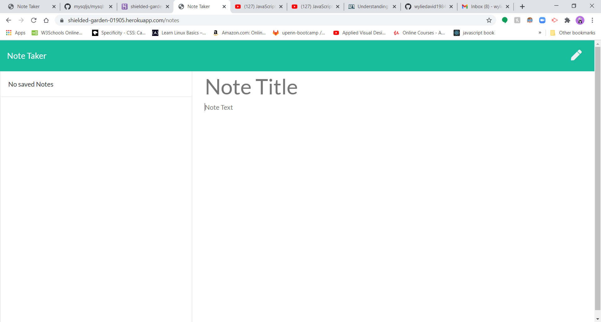
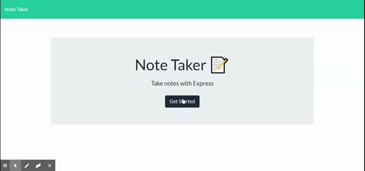

# noteTaker

## Description 

Created an application that can be used to write, save, and delete notes. This application uses an express backend and save and retrieve note data from a JSON file.
I used several technologies beyond express to help with the application. 

### Table Of Contents

-[Description](#Description)

-[Technologies](#Technologies)
   
-[Usages](#Usages)

-[Visuals](#Visuals)

-[Credits](#Credits)

-[License](#License) 

## Technologies

Expand to see technologies used

### Javascript

The index.js file was provided, so that we could work with html inputs as well as request methods.  It made use of jQuery. I also create a module that exported several functions to help with getting data. the function were to get data, add, and delete it from the data base.

#### Node

I used node to initialize package.json. After the initialization, I added express via NPM.  Also used node to run the local server instance. I also required a few built-in modules as well as making one of my own. The built in modules that I used were path, util, and file system.  I use path to shorten code in server place by setting up variable that made paths to different file through out the application. FS was used to read and write files. FS would read a file in a get request to display content to the page. In the post request, I would push up the new data from the user and write a file with the new content to allow it to display on the page. I also used it in the delete request after I removed items from an array to display the new array. 

#### NPM

I used npm to install the dependency express that did most of the heavy lifting for this application. I also installed uuid to help with creating ids. 

#### Express

Express made coding this application much easier. I made use of the express function through a variable named app.  It helped to reduce the amount of code needed to make requests and responses.  

I built routes and stored them in the routes files. One to deal with apis and the second to deal with html. I used the express router function to make it easier to set up the requests.  In the html routes mainly made get requests to grab the two different html pages that were stored in the views folder. Index is setup so that any file extension put in will take you the index. The other route will take you to the notes html that will take in user input.  I also used router in the api routes that I setup. In the api file I used more than the get requests. I made use of post to get data and resend the incoming data and us the response to put it back on the html page with the help of our file system node application.  I did the same thing with the delete 

### CSS

I made use of all the bootstraps classes to style the html.

### HTML

All the html was provided.  I add some additional spacing, and style provided by bootstrap.  Each html was setup to generate by the job class.

## Usages

For users that need to keep track of a lot of information, it's easy to forget or be unable to recall something important. Being able to take persistent notes allows users to have written information available when needed.

### Visuals

Screen Shots and Gif with Video link

Click on the gif to be linked to the video

## Credits

* [Node Documents](https://nodejs.org/api/index.html)
* [npm Documents](https://www.npmjs.com/)
* [Express.js](https://expressjs.com/)
* [Stack Overflow](https://stackoverflow.com/)

## License

MIT License

Copyright (c) 2020 David Wylie

## Contact

* [David Wylie Github](https://github.com/wyliedavid1984)